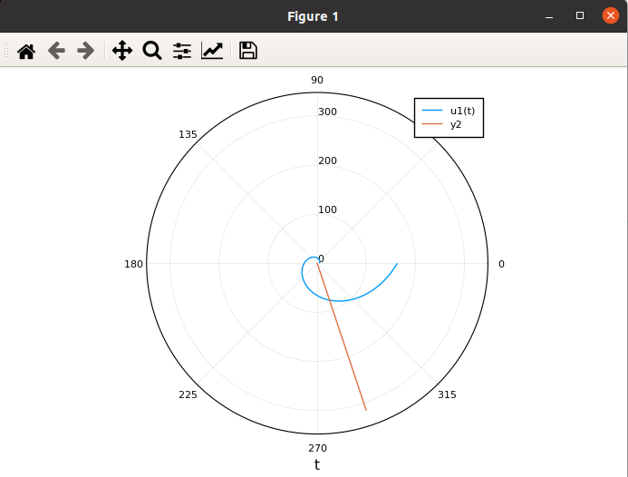
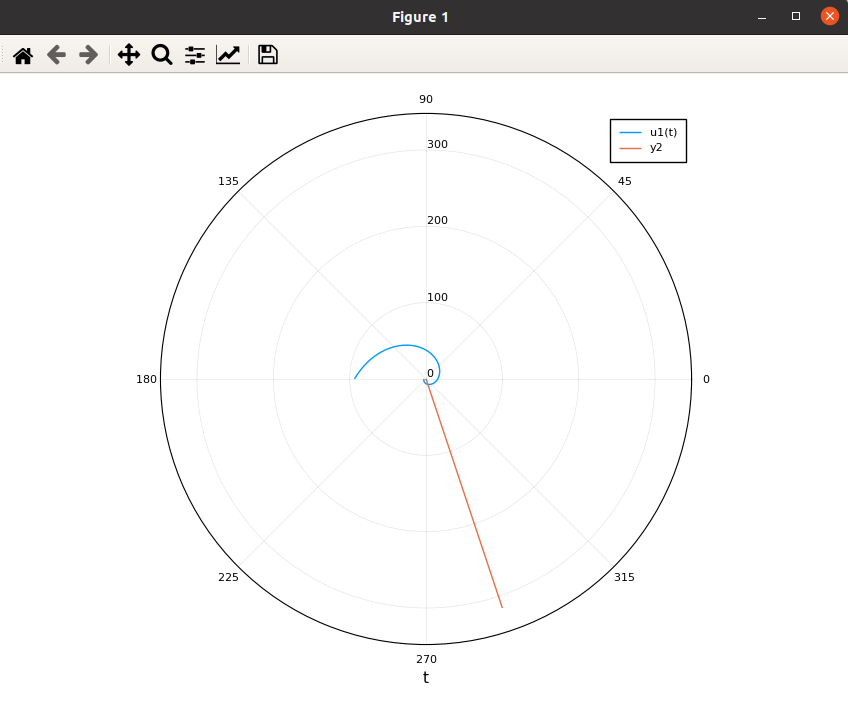

---
## Front matter
lang: ru-RU
title: Задача о погоне
author: Смирнова Мария
institute: RUDN University, Moscow, Russian Federation
groupe: НФИбд-01-18
date: 27 марта 2021

## Formatting
toc: false
slide_level: 2
theme: metropolis
header-includes: 
 - \metroset{progressbar=frametitle,sectionpage=progressbar,numbering=fraction}
 - '\makeatletter'
 - '\beamer@ignorenonframefalse'
 - '\makeatother'
aspectratio: 43
section-titles: true

---

# Задача о погоне

## Цель работы

Рассмотреть модель задачи о погоде. Научиться решать задачу о погоне с помощью julia.

## Постановка задачи

Приведем один из примеров построения математических моделей для выбора правильной стратегии при решении задач поиска.
Рассмотрим задачу преследования браконьеров береговой охраной. На море в тумане катер береговой охраны преследует лодку браконьеров.
Через определенный промежуток времени туман рассеивается, и лодка обнаруживается на расстоянии 11.7 км от катера. Затем лодка снова скрывается в
тумане и уходит прямолинейно в неизвестном направлении. Известно, что скорость
катера в 3.7 раз больше скорости браконьерской лодки.
Необходимо определить по какой траектории необходимо двигаться катеру, чтобы нагнать лодку.

# Выполненные задачи

## Задание 1

Построим траекторию движения катера и лодки для первого случая, найдем точку пересечения их траекторий.

## График 1

Решая данную систему для первого случая получим следующий график (рис.1):
{ #fig:001 width=70% }

## Задание 2

Теперь проделаем те же самые действия для второго случая.

## График 2

Решая данную систему для второго случая получим следующий график (рис.2):
{ #fig:002 width=70% }

## Выводы

В процессе выполнения лабораторной работы мы познакомились с задачей о погоде и построили траекторию движения катера и лодки для двух случаев.

