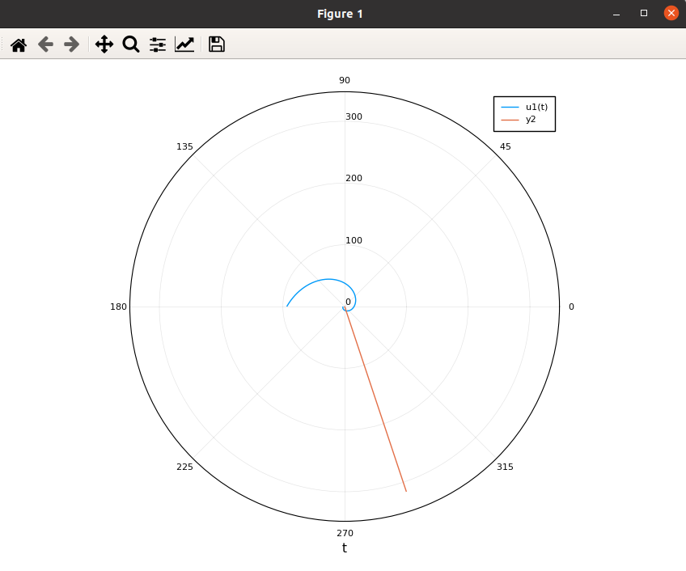

---
# Front matter
lang: ru-RU
title: "Отчет по лабораторной работе 2"
subtitle: "Задача о погоне"
subject: "Математическое моделирование"
author: "Смирнова Мария Александровна"
groupe: "НФИбд-01-18"

# Formatting
toc-title: "Содержание"
toc: true # Table of contents
toc_depth: 2
lof: true # List of figures
lot: true # List of tables
fontsize: 12pt
linestretch: 1.5
papersize: a4paper
documentclass: scrreprt
polyglossia-lang: russian
polyglossia-otherlangs: english
mainfont: PT Serif
romanfont: PT Serif
sansfont: PT Sans
monofont: PT Mono
mainfontoptions: Ligatures=TeX
romanfontoptions: Ligatures=TeX
sansfontoptions: Ligatures=TeX,Scale=MatchLowercase
monofontoptions: Scale=MatchLowercase
indent: true
pdf-engine: lualatex
header-includes:
  - \linepenalty=10 # the penalty added to the badness of each line within a paragraph (no associated penalty node) Increasing the value makes tex try to have fewer lines in the paragraph.
  - \interlinepenalty=0 # value of the penalty (node) added after each line of a paragraph.
  - \hyphenpenalty=50 # the penalty for line breaking at an automatically inserted hyphen
  - \exhyphenpenalty=50 # the penalty for line breaking at an explicit hyphen
  - \binoppenalty=700 # the penalty for breaking a line at a binary operator
  - \relpenalty=500 # the penalty for breaking a line at a relation
  - \clubpenalty=150 # extra penalty for breaking after first line of a paragraph
  - \widowpenalty=150 # extra penalty for breaking before last line of a paragraph
  - \displaywidowpenalty=50 # extra penalty for breaking before last line before a display math
  - \brokenpenalty=100 # extra penalty for page breaking after a hyphenated line
  - \predisplaypenalty=10000 # penalty for breaking before a display
  - \postdisplaypenalty=0 # penalty for breaking after a display
  - \floatingpenalty = 20000 # penalty for splitting an insertion (can only be split footnote in standard LaTeX)
  - \raggedbottom # or \flushbottom
  - \usepackage{float} # keep figures where there are in the text
  - \floatplacement{figure}{H} # keep figures where there are in the text
---

# Цель работы

Рассмотреть модель задачи о погоде. Научиться решать задачу о погоне с помощью julia.

# Краткая теоретическая справка

Приведем один из примеров построения математических моделей для выбора правильной стратегии при решении задач поиска.
Рассмотрим задачу преследования браконьеров береговой охраной. На море в тумане катер береговой охраны преследует лодку браконьеров.
Через определенный промежуток времени туман рассеивается, и лодка обнаруживается на расстоянии k км от катера. Затем лодка снова скрывается в
тумане и уходит прямолинейно в неизвестном направлении. Известно, что скорость
катера в n раз больше скорости браконьерской лодки.
Необходимо определить по какой траектории необходимо двигаться катеру, чтобы нагнать лодку.

# Решение задачи

   1. Примем за, $t_0$, $x_{l0}$ - место нахождения лодки браконьеров в момент обнаружения, $x_{k0} = k$ - место нахождения катера береговой охраны относительно лодки браконьеров в момент обнаружения лодки.
   2. Введем полярные координаты. Считаем, что полюс - точка обнаружения лодки браконьеров $x_{l0}$ ($\theta = x_{l0} = 0$), а полярная ось $r$ проходит через точку нахождения катера береговой охраны.
   3. Траектория катера должна быть такой, чтобы и катер и лодка были на одном расстоянии от полюса $\theta$. Поэтому, катер должен двигаться некоторое время прямолинейно, пока и катер и лодка не окажутся на одном расстоянии от $\theta$. После этого катер должен двигаться вокруг полюса, чтобы в какой-то момент времени настигнуть лодку.
   4. Вычислим значение времени, которое катер должен двигаться прямолинейно. Это значение $t_1$ катера, очевидно, равно значению $t_2$ лодки. Пусть, x - путь, который пройдет за это время лодка, тогда

$$ \frac{x}{v} = \frac{k - x}{nv} \Rightarrow xn = k - x \Rightarrow x = \frac{k}{n + 1} $$

или

$$ \frac{x}{v} = \frac{k + x}{nv} \Rightarrow xn = k + x \Rightarrow x = \frac{k}{n -1}, $$

в зависимости от начального положения катера относительно полюса. В нашем случае:

$$ x_1 = \frac{11.7}{4.7}, x_2 = \frac{11.7}{2.7}. $$

   5. После того, как и лодка и катер окажутся на одном расстоянии от $\theta$, катер должен двигаться от $\theta$ со скоростью, равной скорости лодки, и с линейной скоростью вращения относительно полюса. То есть, разложим вектор $\overrightarrow{v_{k}}$ на 2 составляющие: радиальную (скорость, с которой катер удаляется от полюса) и тангенциальную(скорость, с которой катер линейно вращается вокруг полюса). Соответственно:

$$ v_r = \frac{dr}{dt}, v_{\tau} = r * \frac{d\theta}{dt}. $$

Так как $v_r$ = $v_{l}$, то $\frac{dr}{dt} = v_{l}$.
   6. Решение задачи сводится к решению системы:

$$ \begin{cases} \frac{dr}{dt} = v \ \frac{d\theta}{dt} * r = \sqrt{3}v \ \end{cases} $$

С начальными условиями $\begin{cases} \theta_0 = 0 \ r_0 = 4.7 \end{cases}$ и $\begin{cases} \theta_1 = -\pi \ r_1 = 2.7 \end{cases}$.

Исключая из системы производную по t получим:

$$ \frac{dr}{d\theta} = \frac{r}{\sqrt{3}}. $$

# Выполнение лабораторной работы

1. Выполним задание для первого случая. Код julia:

using Plots 

using DifferentialEquations 

Plots.pyplot() 

s=11.7; 

r0 = s/(2.7); 

tetha0 = 0;

f1(r, p, tetha) = r/sqrt(3); 

f2(t) = atan(-3); 

f3(t) = sqrt(10)*t;

tetha = (tetha0,2*pi); 

prob = ODEProblem(f1, r0, tetha); 

sol = solve(prob);

t=range(0,100, step=1); 

fi = f2.(t); 

ro = f3.(t);

plot(sol, proj=:polar) 

plot!(fi, ro)

Получим следующий график (рис.1)

{ #fig:001 width=70% }

2. Выполним задание для второго случая. Код julia:

using Plots

using DifferentialEquations

Plots.pyplot()

s=11.7;

r0 = s/(4.7); 

tetha0 = -pi; 

f1(r, p, tetha) = r/sqrt(3);

f2(t) = atan(-3);

f3(t) = sqrt(10)*t;

tetha = (tetha0, pi);

prob = ODEProblem(f1, r0, tetha);

sol = solve(prob);

t=range(0,100, step=1);

fi = f2.(t);

ro = f3.(t);

plot(sol, proj=:polar)

plot!(fi, ro)

Получим следующий график (рис.2)

{ #fig:002 width=70% }

# Выводы

В процессе выполнения лабораторной работы мы познакомились с задачей о погоде и построили траекторию движения катера и лодки для двух случаев.
