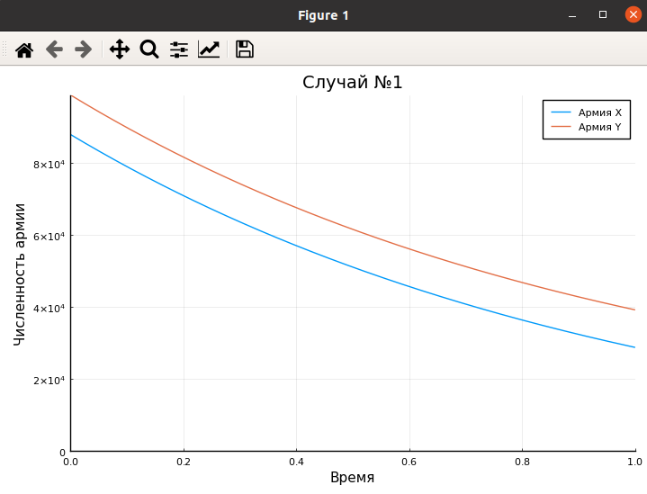
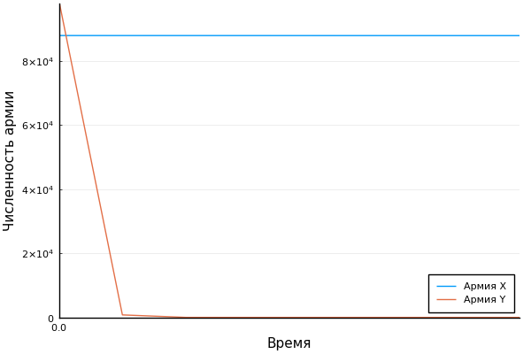

---
## Front matter
lang: ru-RU
title: Модель боевых действий
author: Смирнова Мария
institute: RUDN University, Moscow, Russian Federation
groupe: НФИбд-01-18
date: 27 марта 2021

## Formatting
toc: false
slide_level: 2
theme: metropolis
header-includes: 
 - \metroset{progressbar=frametitle,sectionpage=progressbar,numbering=fraction}
 - '\makeatletter'
 - '\beamer@ignorenonframefalse'
 - '\makeatother'
aspectratio: 43
section-titles: true

---

# Модель боевых действий

## Цель работы

Рассмотреть простейшие модели боевых действий - модели Ланчестера. Построить графики для двух случаев ведения боевых действий.

## Постановка задачи

Между страной Х и страной У идет война. Численность состава войск исчисляется от начала войны, и являются временными функциями x(t) и y(t). В начальный момент времени страна Х имеет армию численностью 88 000 человек, а в распоряжении страны Y армия численностью в 99 000 человек. Для упрощения модели считаем, что коэффициенты a, b, c, h постоянны. Также считаем P(t) и Q(t) непрерывные функции.

Постройте графики изменения численности войск армии Х и армии У для следующих случаев:

   1. Модель боевых действий между регулярными войсками

   2. Модель ведения боевых действий с участием регулярных войск и партизанских отрядов 

# Выполненные задачи

## Задание 1

Построим график изменения численности войск армии Х и армии У для первого случая:
модель боевых действий между регулярными войсками $$ \frac{dx}{dt} = - 0.45 * x(t) - 0.55 * y(t) + \sin{t + 15} $$ $$ \frac{dy}{dt} = - 0.58 * x(t) - 0.45 * y(t) + \cos{t + 3} $$

## График 1

Решая данную систему для первого случая получим следующий график (рис.1):
{ #fig:001 width=70% }

## Задание 2

Построим график изменения численности войск армии Х и армии У для второго случая:
модель боевых действий с участием регулярных войск и партизанских отрядов $$ \frac{dx}{dt} = - 0.38 * x(t) - 0.67 * y(t) + \sin{7t} + 1 $$ $$ \frac{dy}{dt} = - 0.57 * x(t) * y(t) - 0.39 * y(t) + \cos{8t} + 1 $$

## График 2

Решая данную систему для второго случая получим следующий график (рис.2):
{ #fig:002 width=70% }

## Выводы

В процессе выполнения лабораторной работы мы рассмотрели простейшие модели боевых действий - модели Ланчестера. Также построили графики для двух случаев ведения боевых действий.

