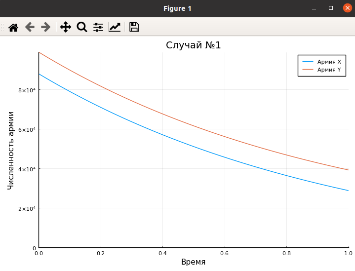
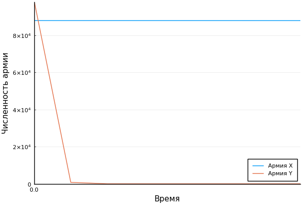

---
# Front matter
lang: ru-RU
title: "Отчет по лабораторной работе 3"
subtitle: "Модель боевых действий"
subject: "Математическое моделирование"
author: "Смирнова Мария Александровна"
groupe: "НФИбд-01-18"

# Formatting
toc-title: "Содержание"
toc: true # Table of contents
toc_depth: 2
lof: true # List of figures
lot: true # List of tables
fontsize: 12pt
linestretch: 1.5
papersize: a4paper
documentclass: scrreprt
polyglossia-lang: russian
polyglossia-otherlangs: english
mainfont: PT Serif
romanfont: PT Serif
sansfont: PT Sans
monofont: PT Mono
mainfontoptions: Ligatures=TeX
romanfontoptions: Ligatures=TeX
sansfontoptions: Ligatures=TeX,Scale=MatchLowercase
monofontoptions: Scale=MatchLowercase
indent: true
pdf-engine: lualatex
header-includes:
  - \linepenalty=10 # the penalty added to the badness of each line within a paragraph (no associated penalty node) Increasing the value makes tex try to have fewer lines in the paragraph.
  - \interlinepenalty=0 # value of the penalty (node) added after each line of a paragraph.
  - \hyphenpenalty=50 # the penalty for line breaking at an automatically inserted hyphen
  - \exhyphenpenalty=50 # the penalty for line breaking at an explicit hyphen
  - \binoppenalty=700 # the penalty for breaking a line at a binary operator
  - \relpenalty=500 # the penalty for breaking a line at a relation
  - \clubpenalty=150 # extra penalty for breaking after first line of a paragraph
  - \widowpenalty=150 # extra penalty for breaking before last line of a paragraph
  - \displaywidowpenalty=50 # extra penalty for breaking before last line before a display math
  - \brokenpenalty=100 # extra penalty for page breaking after a hyphenated line
  - \predisplaypenalty=10000 # penalty for breaking before a display
  - \postdisplaypenalty=0 # penalty for breaking after a display
  - \floatingpenalty = 20000 # penalty for splitting an insertion (can only be split footnote in standard LaTeX)
  - \raggedbottom # or \flushbottom
  - \usepackage{float} # keep figures where there are in the text
  - \floatplacement{figure}{H} # keep figures where there are in the text
---

# Цель работы

Рассмотреть простейшие модели боевых действий - модели Ланчестера. Построить графики для двух случаев ведения боевых действий.

# Краткая теоретическая справка

Рассмотрим некоторые простейшие модели боевых действий – модели Ланчестера. В противоборстве могут принимать участие как регулярные войска, так и партизанские отряды. В общем случае главной характеристикой соперников являются численности сторон. Если в какой-то момент времени одна из численностей обращается в нуль, то данная сторона считается проигравшей (при условии, что численность другой стороны в данный момент положительна).

Рассмотрим три случая ведения боевых действий:

   1. Боевые действия между регулярными войсками. 
   Данная модель описывается таким дифференциальным уравнением: $$ \frac{dx}{dt} = - a(t)x(t) - b(t)y(t) + P(t) $$ $$ \frac{dy}{dt} = - c(t)x(t) - h(t)y(t) + Q(t) $$

   2. Боевые действия с участием регулярных войск и партизанских отрядов. 
   Данная модель описывается таким дифференциальным уравнением: $$ \frac{dx}{dt} = - a(t)x(t) - b(t)y(t) + P(t) $$ $$ \frac{dy}{dt} = - c(t)x(t)y(t) - h(t)y(t) + Q(t) $$

   3. Боевые действия между партизанскими отрядами. 
   Данная модель описывается таким дифференциальным уравнением: $$ \frac{dx}{dt} = - a(t)x(t) - b(t)x(t)y(t) + P(t) $$ $$ \frac{dy}{dt} = - h(t)y(t) - c(t)x(t)y(t) + Q(t) $$
   
Здесь: члены $a$ и $h$ - коэффициенты потерь, которые не связаны с боевыми действиями, $b$ и $c$ - коэффициенты потерь на поле боя, $P(t)$ и $Q(t)$ - функции, которые учитывают возможности подхода подкрепления к войскам Х и У в течение одного дня.

# Задание

### Вариант 27 

Между страной Х и страной У идет война. Численность состава войск исчисляется от начала войны, и являются временными функциями x(t) и y(t). В начальный момент времени страна Х имеет армию численностью 88 000 человек, а в распоряжении страны Y армия численностью в 99 000 человек. Для упрощения модели считаем, что коэффициенты a, b, c, h постоянны. Также считаем P(t) и Q(t) непрерывные функции.

Постройте графики изменения численности войск армии Х и армии У для следующих случаев:

   1. Модель боевых действий между регулярными войсками $$ \frac{dx}{dt} = - 0.45 * x(t) - 0.55 * y(t) + \sin{t + 15} $$ $$ \frac{dy}{dt} = - 0.58 * x(t) - 0.45 * y(t) + \cos{t + 3} $$

   2. Модель ведения боевых действий с участием регулярных войск и партизанских отрядов $$ \frac{dx}{dt} = - 0.38 * x(t) - 0.67 * y(t) + \sin{7t} + 1 $$ $$ \frac{dy}{dt} = - 0.57 * x(t) * y(t) - 0.39 * y(t) + \cos{8t} + 1 $$

# Выполнение лабораторной работы

1. Построим модель боевых действий между регулярными войсками. Код julia:

using Plots

using DifferentialEquations

pyplot()

x0 = 88000;

y0 = 99000;

a = 0.45;

b = 0.55;

c = 0.58;

h = 0.45;

tmax = 1;

t = (0,tmax);

P(t) = sin(t + 15);

Q(t) = cos(t + 3);

function syst(du, u, p, t)

    a, b, c, h = p;

    du[1] = -a * u[1] - b * u[2] + P(t);

    du[2] = -c * u[1] - h * u[2] + Q(t);

end

u0 = [x0, y0];

p = (a,b,c,h);

prob = ODEProblem(syst, u0, t, p);

sol = solve(prob);

plot(sol, ylims=(0, 99000), xlabel = "Время", ylabel = "Численность армии", label = ["Армия X" "Армия Y"])

title!("Случай №1")

Получим следующий график (рис.1)

{ #fig:001 width=70% }

2. Построим модель боевых действий с участием регулярных войск и партизанских отрядов. Код julia:

using Plots

using DifferentialEquations

pyplot()

x0 = 88000;

y0 = 99000;

a = 0.38;

b = 0.67;

c = 0.57;

h = 0.39;

tmax = 1;

t = (0,tmax);

P(t) = sin(7 * t) + 1;

Q(t) = cos(8 * t) + 1;

function syst(du, u, p, t)

    a, b, c, h = p;

    du[1] = -a * u[1] - b * u[2] + P(t);

    du[2] = -c * u[1] * u[2] - h * u[2] + Q(t);

end

u0 = [x0, y0];

p = (a,b,c,h);

prob = ODEProblem(syst, u0, t, p);

sol = solve(prob);

plot(sol, ylims=(0, 99000), xlabel = "Время", ylabel = "Численность армии", label = ["Армия X" "Армия Y"])

title!("Случай №2")

Получим следующий график (рис.2)

{ #fig:002 width=70% }

# Выводы

В процессе выполнения лабораторной работы мы познакомились с моделью боевых действий и построили графики для двух вариантов ведения боевых действий.
