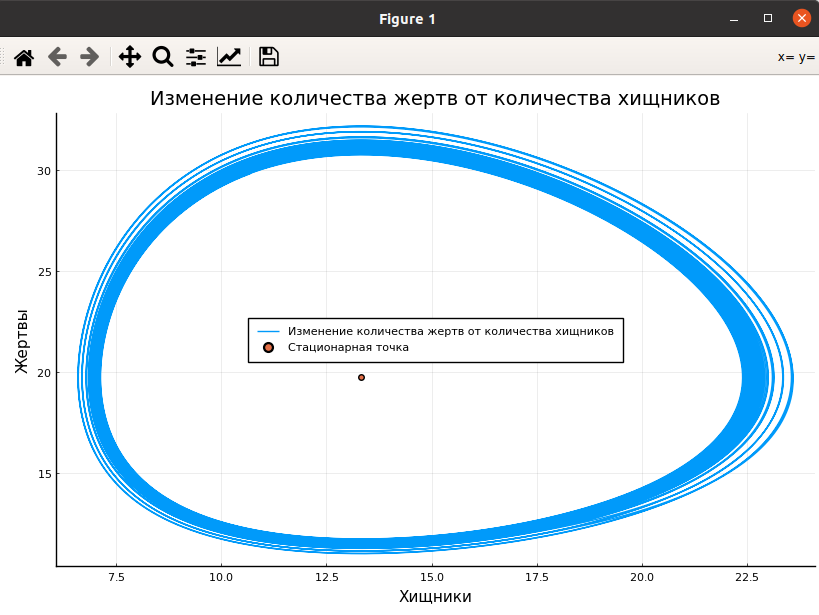
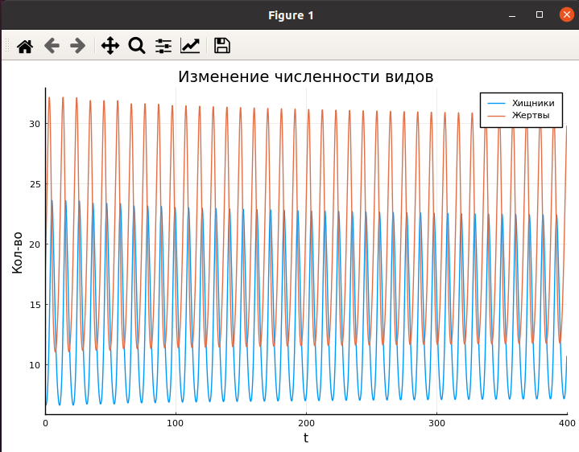

---
## Front matter
lang: ru-RU
title: Модель хищник-жертва
author: Смирнова Мария
institute: RUDN University, Moscow, Russian Federation
groupe: НФИбд-01-18
date: 13 марта 2021

## Formatting
toc: false
slide_level: 2
theme: metropolis
header-includes: 
 - \metroset{progressbar=frametitle,sectionpage=progressbar,numbering=fraction}
 - '\makeatletter'
 - '\beamer@ignorenonframefalse'
 - '\makeatother'
aspectratio: 43
section-titles: true

---

# Модель хищник-жертва

## Цель работы

Рассмотреть модель Лотки-Вольтерры - простейшую модель взаимодействия двух видов типа "хищник-жертва". Построить график зависимости численности хищников от численности жертв. Построить график изменения численности видов при заданных начальных условиях. Найти стационарное состояние системы.

## Постановка задачи

Для модели «хищник-жертва»:

$$ \begin{cases} \frac{\partial{x}}{\partial{t}} = -0.73x(t) + 0.037x(t)y(t) \ \frac{\partial{y}}{\partial{t}} = 0.52y(t) - 0.039x(t)y(t) \ \end{cases} $$

Постройте график зависимости численности хищников от численности жертв, а также графики изменения численности хищников и численности жертв при следующих начальных условиях: $x_0 = 7, y_0 = 16$. Найдите стационарное состояние системы.

# Выполненные задачи

## Задание 1

Построим график зависимости численности хищников от численности жертв. Найдем на графике стационарную точку.

## График 1

Посредством решения системы дифференциальных уравнений и нахождения стационарной точки получим следующий график (рис.1):
{ #fig:001 width=70% }

## Задание 2

Построим график изменения численности хищников и численности жертв при заданных начальных условиях.

## График 2

Получим следующий график (рис.2):
{ #fig:002 width=70% }

## Выводы

В процессе выполнения работы мы рассмотрели модель Лотки-Вольтерры - простейшую модель взаимодействия двух видов типа "хищник-жертва". Построили график зависимости численности хищников от численности жертв. Построили график изменения численности видов при заданных начальных условиях. Нашли стационарное состояние системы.

