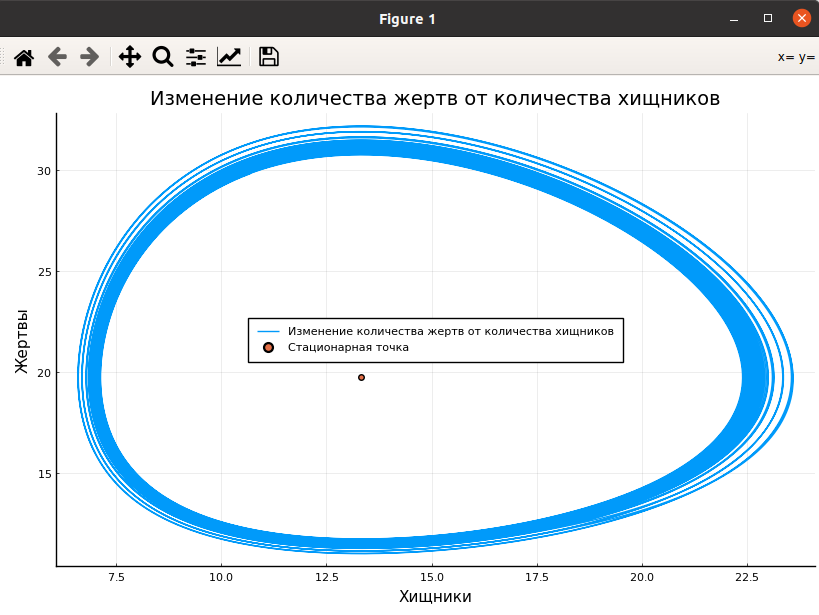
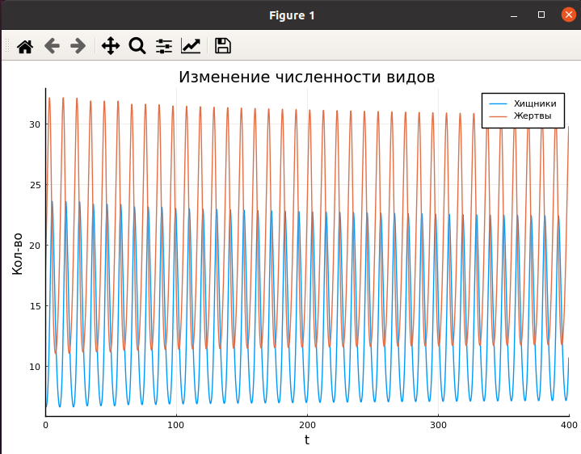

---
# Front matter
lang: ru-RU
title: "Отчет по лабораторной работе 5"
subtitle: "Модель хищник-жертва"
subject: "Математическое моделирование"
author: "Смирнова Мария Александровна"
groupe: "НФИбд-01-18"

# Formatting
toc-title: "Содержание"
toc: true # Table of contents
toc_depth: 2
lof: true # List of figures
lot: true # List of tables
fontsize: 12pt
linestretch: 1.5
papersize: a4paper
documentclass: scrreprt
polyglossia-lang: russian
polyglossia-otherlangs: english
mainfont: PT Serif
romanfont: PT Serif
sansfont: PT Sans
monofont: PT Mono
mainfontoptions: Ligatures=TeX
romanfontoptions: Ligatures=TeX
sansfontoptions: Ligatures=TeX,Scale=MatchLowercase
monofontoptions: Scale=MatchLowercase
indent: true
pdf-engine: lualatex
header-includes:
  - \linepenalty=10 # the penalty added to the badness of each line within a paragraph (no associated penalty node) Increasing the value makes tex try to have fewer lines in the paragraph.
  - \interlinepenalty=0 # value of the penalty (node) added after each line of a paragraph.
  - \hyphenpenalty=50 # the penalty for line breaking at an automatically inserted hyphen
  - \exhyphenpenalty=50 # the penalty for line breaking at an explicit hyphen
  - \binoppenalty=700 # the penalty for breaking a line at a binary operator
  - \relpenalty=500 # the penalty for breaking a line at a relation
  - \clubpenalty=150 # extra penalty for breaking after first line of a paragraph
  - \widowpenalty=150 # extra penalty for breaking before last line of a paragraph
  - \displaywidowpenalty=50 # extra penalty for breaking before last line before a display math
  - \brokenpenalty=100 # extra penalty for page breaking after a hyphenated line
  - \predisplaypenalty=10000 # penalty for breaking before a display
  - \postdisplaypenalty=0 # penalty for breaking after a display
  - \floatingpenalty = 20000 # penalty for splitting an insertion (can only be split footnote in standard LaTeX)
  - \raggedbottom # or \flushbottom
  - \usepackage{float} # keep figures where there are in the text
  - \floatplacement{figure}{H} # keep figures where there are in the text
---

# Цель работы

Рассмотреть модель Лотки-Вольтерры - простейшую модель взаимодействия двух видов типа "хищник-жертва". Построить график зависимости численности хищников от численности жертв. Построить график изменения численности видов при заданных начальных условиях. Найти стационарное состояние системы.

# Краткая теоретическая справка

Простейшая модель взаимодействия двух видов типа «хищник — жертва» -
модель Лотки-Вольтерры. Данная двувидовая модель основывается на
следующих предположениях:
1. Численность популяции жертв x и хищников y зависят только от времени
(модель не учитывает пространственное распределение популяции на
занимаемой территории)
2. В отсутствии взаимодействия численность видов изменяется по модели
Мальтуса, при этом число жертв увеличивается, а число хищников падает
3. Естественная смертность жертвы и естественная рождаемость хищника
считаются несущественными
4. Эффект насыщения численности обеих популяций не учитывается
5. Скорость роста численности жертв уменьшается пропорционально
численности хищников

dx/dt = ax(t) - bx(t)*y(t)
dy/dt = - cy(t) - dx(t)*y(t)       (1)

В этой модели x – число жертв, y - число хищников. Коэффициент a
описывает скорость естественного прироста числа жертв в отсутствие хищников, с
- естественное вымирание хищников, лишенных пищи в виде жертв. Вероятность
взаимодействия жертвы и хищника считается пропорциональной как количеству
жертв, так и числу самих хищников (xy). Каждый акт взаимодействия уменьшает
популяцию жертв, но способствует увеличению популяции хищников (члены -bxy
и dxy в правой части уравнения).

{ #fig:001 width=70% }

Математический анализ этой (жесткой) модели показывает, что имеется
стационарное состояние (A на рис.1), всякое же другое начальное состояние (B) приводит к периодическому колебанию численности как жертв, так и хищников,
так что по прошествии некоторого времени система возвращается в состояние B.

Стационарное состояние системы (1) (положение равновесия, не зависящее от
времени решение) будет в точке: x0 = c/d, y0 = a/b. Если начальные значения задать в стационарном состоянии x(0) = x0, y(0) = y0, то в любой момент времени
численность популяций изменяться не будет. При малом отклонении от положения
равновесия численности как хищника, так и жертвы с течением времени не
возвращаются к равновесным значениям, а совершают периодические колебания
вокруг стационарной точки. Амплитуда колебаний и их период определяется
начальными значениями численностей x(0), y(0). Колебания совершаются в
противофазе.

# Задание

Вариант 27

Для модели «хищник-жертва»:

$$ \begin{cases} \frac{\partial{x}}{\partial{t}} = -0.73x(t) + 0.037x(t)y(t) \ \frac{\partial{y}}{\partial{t}} = 0.52y(t) - 0.039x(t)y(t) \ \end{cases} $$

Постройте график зависимости численности хищников от численности жертв, а также графики изменения численности хищников и численности жертв при следующих начальных условиях: $x_0 = 7, y_0 = 16$. Найдите стационарное состояние системы.

# Выполнение лабораторной работы

1. Построим график зависимости численности хищников от численности жертв. Найдем на графике стационарную точку. Код julia:

using Plots 

using DifferentialEquations

pyplot();

a = 0.73;

b = 0.037;

c = 0.52;

d = 0.039;

t = (0.0, 400.0);

step = 0.01;

p = [a,b,c,d];

x0 = [7,16];

function syst(dx,x,p,t)

    a,b,c,d = p;

    dx[1] = -a*x[1] + b*x[1] * x[2];

    dx[2] =  c*x[2] - d*x[1] * x[2];

end

prob = ODEProblem(syst, x0, t, p);

sol = solve(prob, saveat = step);

n = length(sol);

y1 = zeros(n);

y2 = zeros(n);

for i in 1:n

    y1[i] = sol.u[i][1];

    y2[i] = sol.u[i][2];

end

plot(y1,y2, xlabel = "Хищники", ylabel = "Жертвы", label = "Изменение количества жертв от количества хищников")

scatter!([c/d], [a/b], label = "Стационарная точка")

title!("Изменение количества жертв от количества хищников")

Получим следующий график (рис.2)

{ #fig:002 width=70% }

2. Построим график изменения численности хищников и численности жертв при заданных начальных условиях. Код julia:

plot(sol, xlabel = "t", ylabel = "Кол-во", label = ["Хищники" "Жертвы"])

title!("Изменение численности видов")

Получим следующий график (рис.3)

{ #fig:003 width=70% }

# Выводы

В процессе выполнения работы мы рассмотрели модель Лотки-Вольтерры - простейшую модель взаимодействия двух видов типа "хищник-жертва". Построили график зависимости численности хищников от численности жертв. Построили график изменения численности видов при заданных начальных условиях. Нашли стационарное состояние системы.
