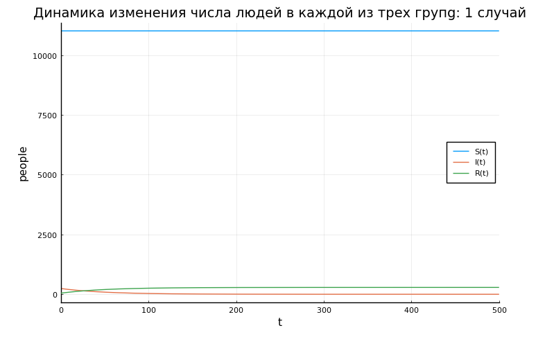
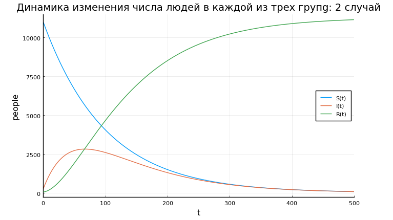

---
## Front matter
lang: ru-RU
title: Задача об эпидемии
author: Смирнова Мария
institute: RUDN University, Moscow, Russian Federation
groupe: НФИбд-01-18
date: 20 марта 2021

## Formatting
toc: false
slide_level: 2
theme: metropolis
header-includes: 
 - \metroset{progressbar=frametitle,sectionpage=progressbar,numbering=fraction}
 - '\makeatletter'
 - '\beamer@ignorenonframefalse'
 - '\makeatother'
aspectratio: 43
section-titles: true

---

# Задача об эпидемии

## Цель работы

Рассмотреть простейшую модель эпидемии. Построить графики изменения числа людей в каждой из трех групп (восприимчивые к болезни, но пока здоровые; инфицированные, также являющиеся распространителями; здоровые с иммунитетом к болезни) для двух случаев.

## Постановка задачи

На одном острове вспыхнула эпидемия. Известно, что из всех проживающих на острове ($N=11300$) в момент начала эпидемии ($t=0$) число заболевших людей (являющихся распространителями инфекции) $I(0)=240$, А число здоровых людей с иммунитетом к болезни $R(0)=46$. Таким образом, число людей восприимчивых к болезни, но пока здоровых, в начальный момент времени $S(0)=N-I(0)- R(0)$.

Постройте графики изменения числа особей в каждой из трех групп. Рассмотрите, как будет протекать эпидемия в случае:

1. Если $I(0) \leq I^*$;

2. Если $I(0) > I^*$.

# Выполненные задачи

## Задание 1

Построим график изменения числа особей в каждой из трех групп для первого случая, когда число заболевших не превышает критического значения.

## График 1

Посредством решения системы дифференциальных уравнений получим следующий график (рис.1):
{ #fig:001 width=70% }

## Задание 2

Построим график изменения числа особей в каждой из трех групп для второго случая, когда число заболевших превышает критическое значение.

## График 2

Получим следующий график (рис.2):
{ #fig:002 width=70% }

## Выводы

Мы рассмотрели простейшую модель эпидемии. Построили графики изменения числа людей в каждой из трех групп (восприимчивые к болезни, но пока здоровые; инфицированные, также являющиеся распространителями; здоровые с иммунитетом к болезни) для двух случаев.

