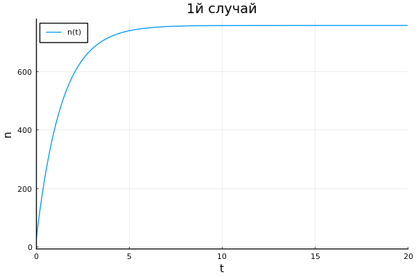
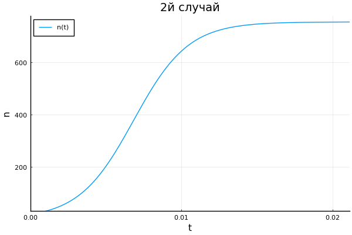
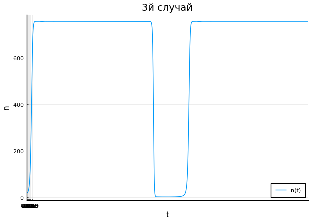

---
## Front matter
lang: ru-RU
title: Эффективность рекламы
author: Смирнова Мария
institute: RUDN University, Moscow, Russian Federation
groupe: НФИбд-01-18
date: 27 марта 2021

## Formatting
toc: false
slide_level: 2
theme: metropolis
header-includes: 
 - \metroset{progressbar=frametitle,sectionpage=progressbar,numbering=fraction}
 - '\makeatletter'
 - '\beamer@ignorenonframefalse'
 - '\makeatother'
aspectratio: 43
section-titles: true

---

# Эффективность рекламы

## Цель работы

Рассмотреть модель эффективности рекламной кампании. Построить графики распространения рекламы для трех случаев.

## Постановка задачи

Постройте график распространения рекламы, математическая модель которой описывается следующим уравнением:
1. $$\frac{\partial{n}}{dt} \ = \ (0.73 + 0.000013n(t))(N - n(t))$$

2. $$\frac{\partial{n}}{dt} \ = \ (0.000013 + 0.73n(t))(N - n(t))$$

3. $$\frac{\partial{n}}{dt} \ = \ (0.55sin{t} + 0.33cos{t}n(t))(N - n(t))$$
При этом объем аудитории N = 756 , в начальный момент о товаре знает 17 человек. Для
случая 2 определите в какой момент времени скорость распространения рекламы будет
иметь максимальное значение.

# Выполненные задачи

## Задание 1

Построим график распространения рекламы для первого случая $\alpha_1(t)>\alpha_2(t)$.

## График 1

Решая данную систему для первого случая получим следующий график (рис.1):
{ #fig:001 width=70% }

## Задание 2

Построим график распространения рекламы для второго случая $\alpha_1(t)<\alpha_2(t)$.

## График 2

Решая данную систему для второго случая получим следующий график (рис.2):
{ #fig:002 width=70% }

## Задание 3

Построим график распространения рекламы для третьего случая.

## График 3

Решая данную систему для третьего случая получим следующий график (рис.3):
{ #fig:003 width=70% }

## Выводы

В процессе выполнения лабораторной работы мы рассмотрели модель эффективности рекламной кампании, а также построили графики распространения рекламы для трех случаев.

