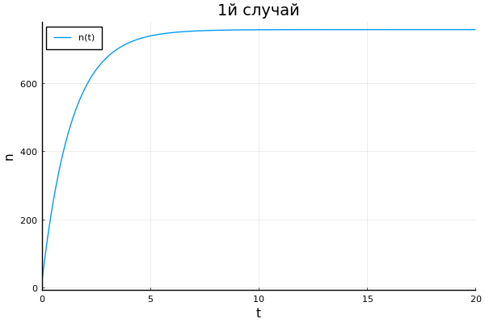
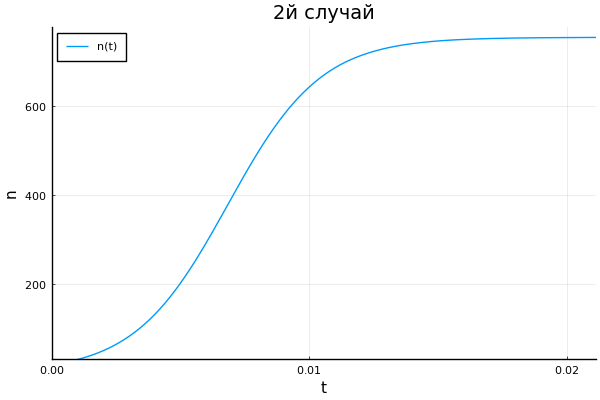
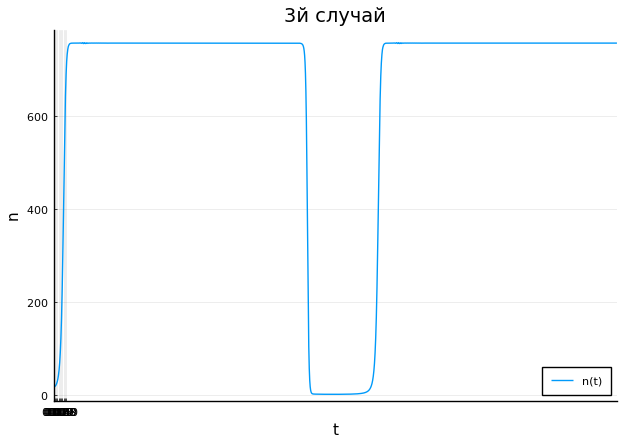

---
# Front matter
lang: ru-RU
title: "Отчет по лабораторной работе 7"
subtitle: "Эффективность рекламы"
subject: "Математическое моделирование"
author: "Смирнова Мария Александровна"
groupe: "НФИбд-01-18"

# Formatting
toc-title: "Содержание"
toc: true # Table of contents
toc_depth: 2
lof: true # List of figures
lot: true # List of tables
fontsize: 12pt
linestretch: 1.5
papersize: a4paper
documentclass: scrreprt
polyglossia-lang: russian
polyglossia-otherlangs: english
mainfont: PT Serif
romanfont: PT Serif
sansfont: PT Sans
monofont: PT Mono
mainfontoptions: Ligatures=TeX
romanfontoptions: Ligatures=TeX
sansfontoptions: Ligatures=TeX,Scale=MatchLowercase
monofontoptions: Scale=MatchLowercase
indent: true
pdf-engine: lualatex
header-includes:
  - \linepenalty=10 # the penalty added to the badness of each line within a paragraph (no associated penalty node) Increasing the value makes tex try to have fewer lines in the paragraph.
  - \interlinepenalty=0 # value of the penalty (node) added after each line of a paragraph.
  - \hyphenpenalty=50 # the penalty for line breaking at an automatically inserted hyphen
  - \exhyphenpenalty=50 # the penalty for line breaking at an explicit hyphen
  - \binoppenalty=700 # the penalty for breaking a line at a binary operator
  - \relpenalty=500 # the penalty for breaking a line at a relation
  - \clubpenalty=150 # extra penalty for breaking after first line of a paragraph
  - \widowpenalty=150 # extra penalty for breaking before last line of a paragraph
  - \displaywidowpenalty=50 # extra penalty for breaking before last line before a display math
  - \brokenpenalty=100 # extra penalty for page breaking after a hyphenated line
  - \predisplaypenalty=10000 # penalty for breaking before a display
  - \postdisplaypenalty=0 # penalty for breaking after a display
  - \floatingpenalty = 20000 # penalty for splitting an insertion (can only be split footnote in standard LaTeX)
  - \raggedbottom # or \flushbottom
  - \usepackage{float} # keep figures where there are in the text
  - \floatplacement{figure}{H} # keep figures where there are in the text
---

# Цель работы

Рассмотреть модель эффективности рекламной кампании. Построить графики распространения рекламы для трех случаев.

# Краткая теоретическая справка

Организуется рекламная кампания нового товара или услуги. Необходимо, чтобы прибыль будущих продаж с избытком покрывала издержки на рекламу. Вначале расходы могут превышать прибыль, поскольку лишь малая часть потенциальных покупателей будет информирована о новинке. Затем, при увеличении числа продаж, возрастает и прибыль, и, наконец, наступит момент, когда рынок насытится, и рекламировать товар станет бесполезным.

Предположим, что торговыми учреждениями реализуется некоторая продукция, о которой в момент времени $t$ из числа потенциальных покупателей N знает лишь $n$ покупателей. Для ускорения сбыта продукции запускается реклама по радио, телевидению и других средств массовой информации. После запуска рекламной кампании информация о продукции начнет распространяться среди потенциальных покупателей путем общения друг с другом. Таким образом, после запуска рекламных объявлений скорость изменения числа знающих о продукции людей пропорциональна как числу знающих о товаре покупателей, так и числу покупателей о нем не знающих

Модель рекламной кампании описывается следующими величинами. Считаем, $\frac{\partial{n}}{dt}$ - скорость изменения со временем числа потребителей, узнавших о товаре и готовых его купить, $t$ - время, прошедшее с начала рекламной кампании, $n(t)$ - число уже информированных клиентов. Эта величина пропорциональна числу покупателей, еще не знающих о нем, это описывается следующим образом: $\alpha_1(t)(N-n(t))$, где $N$ - общее число потенциальных платежеспособных покупателей, $\alpha_1(t)>0$ - характеризует интенсивность рекламной кампании (зависит от затрат на рекламу в данный момент времени). Помимо этого, узнавшие о товаре потребители также распространяют полученную информацию среди потенциальных покупателей, не знающих о нем (в этом случае работает т.н. сарафанное радио). Этот вклад в рекламу описывается величиной $\alpha_2(t)n(t)(N-n(t))$, эта величина увеличивается с увеличением потребителей узнавших о товаре. Математическая модель распространения рекламы описывается уравнением:

$$\frac{\partial{n}}{dt} \ = \ (\alpha_1(t) + \alpha_2(t)n(t))(N - n(t)).$$

# Задание

### Вариант 27 

Постройте график распространения рекламы, математическая модель которой описывается следующим уравнением:

1. $$\frac{\partial{n}}{dt} \ = \ (0.73 + 0.000013n(t))(N - n(t))$$

2. $$\frac{\partial{n}}{dt} \ = \ (0.000013 + 0.73n(t))(N - n(t))$$

3. $$\frac{\partial{n}}{dt} \ = \ (0.55sin{t} + 0.33cos{t}n(t))(N - n(t))$$

При этом объем аудитории $$N = 756$$ , в начальный момент о товаре знает 17 человек. Для
случая 2 определите в какой момент времени скорость распространения рекламы будет
иметь максимальное значение.

# Выполнение лабораторной работы

1. Построим график распространения рекламы для первого случая $\alpha_1(t)>alpha_2(t)$. Код julia:

using Plots 

using DifferentialEquations

pyplot()

N = 756;

x0 = 17;

step = 0.0001;

t = (0.0, 20.0);

a1(t) = 0.73;

a2(t) = 0.000013;

f(x, p, t) = (a1.(t) + a2.(t) * x)*(N - x);

prob = ODEProblem(f, x0, t);

sol = solve(prob, saveat = step);

plot(sol, xlabel = "t", ylabel = "n", labels = "n(t)")

title!("1й случай")

Получим следующий график (рис.1)

{ #fig:001 width=70% }

2. Построим график распространения рекламы для второго случая $\alpha_1(t)<alpha_2(t)$. Код julia:

using Plots 

using DifferentialEquations

pyplot();

N = 756;

x0 = 17;

step = 0.0001;

t = (0.0, 15.0);

a1(t) = 0.000013;

a2(t) = 0.73;

f(x, p, t) = (a1.(t) + a2.(t) * x)*(N - x);

prob = ODEProblem(f, x0, t);

sol = solve(prob, saveat = step);

plot(sol, xlabel = "t", ylabel = "n", labels = "n(t)", xaxis = (0.0:0.01:0.1))

title!("2й случай")

Получим следующий график (рис.2)

{ #fig:002 width=70% }

3. Построим график распространения рекламы для третьего случая. Код julia:

using Plots 

using DifferentialEquations

pyplot();

N = 756;

x0 = 17;

step = 0.0001;

t = (0.0, 15.0);

a1(t) = 0.55*sin(t);

a2(t) = 0.33*sin(5*t);

f(x, p, t) = (a1.(t) + a2.(t) * x)*(N - x);

prob = ODEProblem(f, x0, t);

sol = solve(prob, saveat = step);

plot(sol, xlabel = "t", ylabel = "n", labels = "n(t)", xaxis = (0.0:0.01:0.1))

title!("3й случай")

Получим следующий график (рис.3)

{ #fig:003 width=70% }

# Выводы

В процессе выполнения лабораторной работы мы рассмотрели модель эффективности рекламной кампании, а также построили графики распространения рекламы для трех случаев.
