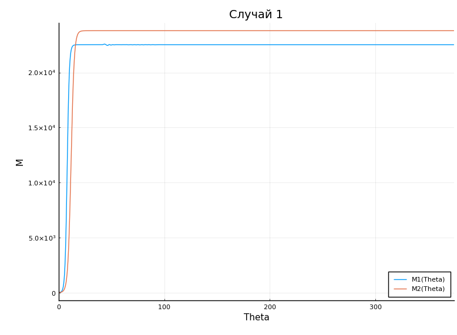
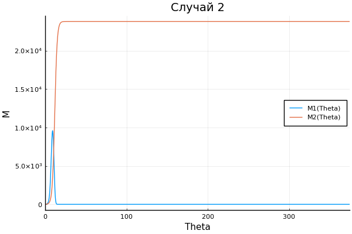

---
## Front matter
lang: ru-RU
title: Модель конкуренции двух фирм
author: Смирнова Мария
institute: RUDN University, Moscow, Russian Federation
groupe: НФИбд-01-18
date: 2 апреля 2021

## Formatting
toc: false
slide_level: 2
theme: metropolis
header-includes: 
 - \metroset{progressbar=frametitle,sectionpage=progressbar,numbering=fraction}
 - '\makeatletter'
 - '\beamer@ignorenonframefalse'
 - '\makeatother'
aspectratio: 43
section-titles: true

---

# Модель конкуренции двух фирм

## Цель работы

Рассмотреть модель конкуренции двух фирм, построить графики изменения оборотных средств фирм для двух случаев.

## Краткая теоретическая справка

## 1 случай

В 1м случае, на рынке устанавливается единая цена, которая определяется балансом суммарного предложения и спроса. Иными словами, в рамках нашей модели конкурентная борьба ведётся только рыночными методами. То есть, конкуренты могут влиять на противника путем изменения параметров своего производства: себестоимость, время цикла, но не могут прямо вмешиваться в ситуацию на рынке («назначать» цену или влиять на потребителей каким- либо иным способом.)

## 2 случай

Во 2-м случае помимо экономического фактора влияния (изменение себестоимости, производственного цикла, использование кредита и т.п.), используются еще и социально-психологические факторы – формирование общественного предпочтения одного товара другому, не зависимо от их качества и цены. В этом случае взаимодействие двух фирм будет зависеть друг от друга.

## Постановка задачи

Случай 1.

$$ \frac{\partial{M_1}}{\partial{\theta}} \ = \ M_1 - \frac{b}{c_1}M_1*M_2 - \frac{a_1}{c_1}M_1^2 \ $$

$$ \frac{\partial{M_2}}{\partial{\theta}} \ = \ \frac{c_2}{c_1}M_2 - \frac{b}{c_1}M_1M_2 - \frac{a_2}{c_1}*M_2^2 \ $$

Случай 2. 

$$ \frac{\partial{M_1}}{\partial{\theta}} \ = \ M_1 - (\frac{b}{c_1} + 0.00017)M_1M_2 - \frac{a_1}{c_1}M_1^2 \ $$

$$ \frac{\partial{M_2}}{\partial{\theta}} \ = \ \frac{c_2}{c_1}M_2 - \frac{b}{c_1}M_1*M_2 - \frac{a_2}{c_1}*M_2^2 \ $$

Соответствующие начальные условия и параметры для обоих случаев:

$$M^1_0 = 7.7, M_0^2 = 8.8$$ $$p_{cr}=39, N=91, q=1$$ $$\tau_1 = 31, \tau_2 = 28$$ $$p_1 = 11.2, p_2 = 15.5$$

# Выполненные задачи

## Задание 1

Построим график изменения оборотных средств фирм для первого случая.

## График 1

Решая данную систему для первого случая получим следующий график (рис.1):
{ #fig:001 width=70% }

## Задание 2

Построим график изменения оборотных средств фирм для второго случая.

## График 2

Решая данную систему для второго случая получим следующий график (рис.2):
{ #fig:002 width=70% }

## Выводы

В процессе выполнения лабораторной работы мы рассмотрели модель конкуренции двух фирм, а также построили графики изменения оборотных средств фирм для двух случаев.

